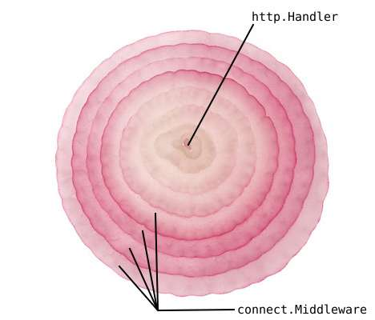

# connect 

connect is an naive way to chain your `func(http.Handler)
http.Handler` middlewares (similar to
[alice](https://github.com/justinas/alice)), inspired by the ideas
presented by [@tsenart](https://github.com/tsenart) at
[Gophercon](https://www.youtube.com/watch?v=xyDkyFjzFVc).

## Todo

- [ ] Add tests.
- [ ] Add examples.
